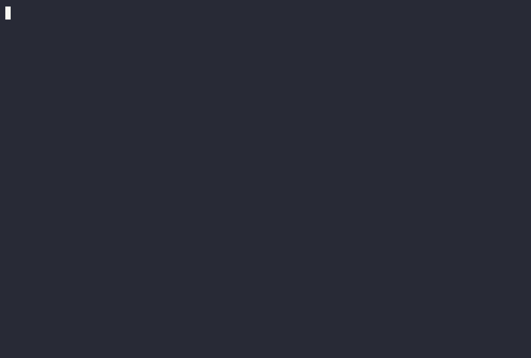

# todo-radar

[](https://github.com/Matheusedu01/todo-radar/actions/workflows/ci.yml)

CLI que varre seu código em busca de comentários `TODO`, `FIXME`, `HACK` e `NOTE`, e gera um relatório — no terminal, em Markdown ou em JSON.

<!--
TODO (não relacionado ao projeto, é um lembrete meu): gravar um GIF de demo
aqui usando `vhs` ou `terminalizer` e colar o link abaixo.

-->

## Por que

Comentários `TODO`/`FIXME` se acumulam em qualquer projeto e ficam esquecidos dentro do código. O `todo-radar` os transforma numa lista visível, que dá pra exportar como relatório de time ou colar num board de tarefas.

## Instalação

```bash
npm install -g todo-radar
```

Ou sem instalar globalmente, direto com `npx`:

```bash
npx todo-radar
```

## Uso

```bash
# escaneia o diretório atual
todo-radar

# escaneia um caminho específico
todo-radar ./src

# escolhe quais tags procurar
todo-radar --tags TODO,FIXME

# exporta como Markdown
todo-radar --format markdown

# exporta como JSON (útil pra integrar com outras ferramentas)
todo-radar --format json

# salva o relatório em um arquivo em vez de imprimir no terminal
todo-radar --format markdown --output relatorio.md
```

Tem uma pasta [`examples/`](./examples) no repositório com alguns TODOs de propósito — depois de clonar, rode `todo-radar examples` pra ver funcionando na hora.

### Opções

| Flag | Descrição | Padrão |
|---|---|---|
| `[path]` | diretório a escanear | `.` |
| `-t, --tags <tags>` | tags a procurar, separadas por vírgula | `TODO,FIXME,HACK,NOTE` |
| `-f, --format <format>` | `table`, `markdown` ou `json` | `table` |
| `-o, --output <file>` | salva em arquivo em vez de imprimir | — |

## Como funciona

O scanner varre os arquivos do projeto (respeitando automaticamente o `.gitignore` e ignorando `node_modules`), identifica o marcador de comentário correto por extensão (`//` e `/*` para C-like, `#` para Python/Ruby/Shell, `<!--` para HTML), e procura pelas tags dentro desses comentários.

**Limitação conhecida:** é uma abordagem baseada em regex, não um parser real da linguagem — então comentários dentro de strings multilinha ou casos muito incomuns de sintaxe podem gerar falso positivo/negativo. Para o caso de uso (encontrar TODOs esquecidos), essa é uma troca consciente entre simplicidade e precisão perfeita.

## Desenvolvimento

```bash
git clone https://github.com/Matheusedu01/todo-radar.git
cd todo-radar
npm install
npm test

# testar a CLI localmente sem publicar
npm link
todo-radar --help
```

### Estrutura do projeto

```
bin/todo-radar.js   → entrypoint executável (registrado no campo "bin" do package.json)
src/scanner.js       → lógica de varredura dos arquivos (core, sem dependência de CLI)
src/formatters.js     → formatação da saída (table/markdown/json)
src/cli.js            → parsing de argumentos e orquestração (commander)
test/                 → testes automatizados (node:test)
fixtures/             → arquivos de exemplo usados nos testes
```

## Roadmap

- [ ] Integração com `git blame` para mostrar quem escreveu cada TODO
- [ ] Flag `--create-issues` para abrir issues no GitHub automaticamente a partir dos achados
- [ ] Suporte a arquivo de configuração (`.todoradarrc`)

## Licença

MIT
